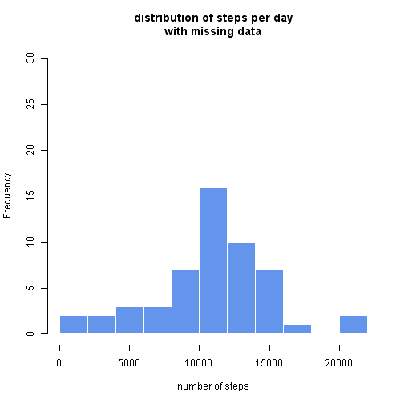
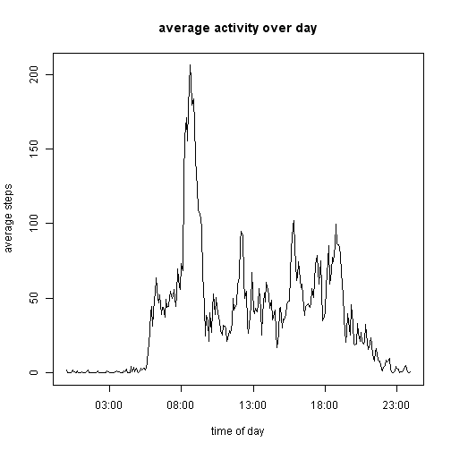
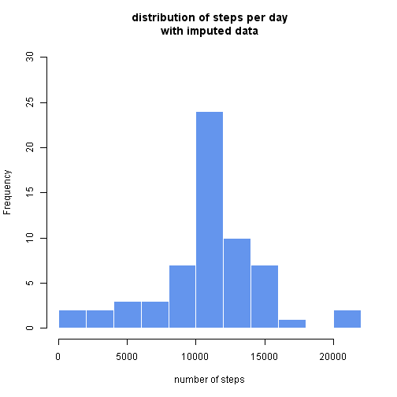
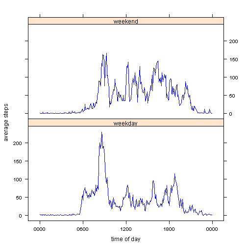

Reproducible Research - assignment 1
====================================

This document shows and explains the R code to read and process the personal activity dataset provided as part of the Reproducible Research course assignment 1.
We start off assuming that the data from the course's github repository, has been unzipped, and saved to the working directory as "activity.csv"

So, to load the data:

```r
data1 <- read.csv(".\\activity.csv",stringsAsFactors=FALSE)
```

The package dplyr is used throughout this work. If you don't already have it installed you will need to install it on  your system, in order to reproduce the analysis. 


The time intervals are given as hours and minutes of the day, but without leading zeros, so we tidy the code by padding with leading zeros and format this a date. R assigns this today's date; a fixed date could be used, but it's of no consequence as the date will not be used, only the time.

```r
data1 <- mutate(data1,interval = sprintf("%04d",data1$interval))
data1 <- mutate(data1,interval = as.POSIXct(data1$interval,
                                            origin="2012-01-01",
                                            format ="%H%M",usetz = FALSE))
```
The dates in the original dataset also need formatting as dates:

```r
data1 <- mutate(data1,date = as.POSIXct(data1$date,
                                        origin="2012-01-01",
                                        usetz = FALSE))
```

Set up the data for dplyr...

```r
data2 <- tbl_df(data1)
```
...then organise it to calculate totals per day

```r
by_date <- group_by(data2,date)
x1 <- summarize(by_date,sum(steps))
colnames(x1)[2] <- "daily_tot_steps"
```

### Histogram of total steps per day

```r
##png(filename="stepsperdayhisto1.png", width=480, height=480)
hist(x1$daily_tot_steps,breaks = 10, col = "cornflowerblue",
     ylim = c(0,30),
     border ="white",
     main = "distribution of steps per day\nwith missing data",
     xlab = "number of steps")
```

 

```r
##dev.off()
```

### Mean total steps per day:

```r
x2 <- mean(x1$daily_tot_steps,na.rm=TRUE)
x2
```

```
## [1] 10766.19
```
### Median total steps per day

```r
x3 <- median(x1$daily_tot_steps,na.rm=TRUE)
x3
```

```
## [1] 10765
```

We need to reorganise the date to calculate mean steps through day...

```r
by_interval <- group_by(data2,interval)
y1 <- summarize(by_interval,mean(steps,na.rm=TRUE))
colnames(y1) <- c("time_of_day","average_steps")
```
...Which allows us to plot it:

### Time series plot of mean steps per day

```r
with(y1, plot(time_of_day,average_steps,type = "l",
              xlab = "time of day",
              ylab = "average steps",
              main ="average activity over day"))
```

 
### Maximum number of steps in any interval during the day:

```r
pb <- max(y1$average_steps)
pb
```

```
## [1] 206.1698
```
### Time interval with highest activity:

```r
days_avg <- arrange(y1,desc(average_steps))
pbtime <- format(days_avg[1,1],format ="%H:%M")
pbtime
```

```
##   time_of_day
## 1       08:35
```
##Imputed Data

There are a number of time intervals for which there is no record, as opposed to intervals in which there were zero steps. We shall substitue synthetic data for these intervals, by applying the average value of steps calculated for any interval for which there is no record.
We start by organising the data into time interval order then subset it into two sets, one with NA in the steps field, and the other set with a record for number of steps. Then we substitute average values for NA values and rejoin the two data sets.

```r
days_avg <- arrange(days_avg,time_of_day)

## separate NAs from the rest
data4 <- subset(data2,is.na(data2$steps),drop=FALSE)
data5 <- subset(data2,!is.na(data2$steps),drop=FALSE)

## tidy and substitute average steps for NAs
data4 <- data4[,2:3]
data4a <- merge(data4, days_avg, by.x = "interval", by.y = "time_of_day")
data4a <- data4a[,c(3,2,1)]
## optional rounding term to make steps integer values
data4a[1] <- round(data4a[1])
colnames(data4a) <- c("steps","date","interval")

## rejoin the data sets to include substituted averages
## with measured data
data6 <- rbind(data4a,data5)
```
We now have a data set with values for each interval on each day, and repeat the methods previously used to provide a similar plot and calculations.

### Histogram of total steps for day with imputed data

```r
##*****tidy data for calculations per day*****
by_date2 <- group_by(data6,date)
p1 <- summarize(by_date2,sum(steps))
colnames(p1)[2] <- "daily_tot_steps"

## *****plot histogram of total steps per day
##png(filename="stepsperdayhisto2.png", width=480, height=480)
hist(p1$daily_tot_steps,breaks = 10, col = "cornflowerblue",
     ylim = c(0,30),
     border ="white",
     main = "distribution of steps per day\nwith imputed data",
     xlab = "number of steps")
```

 

```r
##dev.off()
```
###Mean total steps/day with imputed data

```r
## *****mean of total steps per day*****
p2 <- mean(p1$daily_tot_steps,na.rm=TRUE)
p2
```

```
## [1] 10765.64
```
###Median total steps/day with imputed data

```r
## *****median of total steps per day*****
p3 <- median(p1$daily_tot_steps,na.rm=TRUE)
p3
```

```
## [1] 10762
```
##Comparing weekday and weekend activity

In order to compare step activity at weekends and during the week, we need to derive a weekday/weekend label from the date on which the activity is recorded.
A new data variable is created, and populated with labels calculated from the date.

```r
##*****Add a column to show weekdays and weekends*****
data7 <- mutate(data6, workweek = weekdays(date))
## as before, split into two sets assign factors and recombine
data71 <- subset(data7,data7[,4]=="Saturday"|
                     data7[,4]=="Sunday")

data72 <- subset(data7,data7[,4]=="Monday"|
                 data7[,4]=="Tuesday"|
                 data7[,4]=="Wednesday"|
                 data7[,4]=="Thursday"|
                 data7[,4]=="Friday")

data71 <- mutate(data71,workweek="weekend")
data72 <- mutate(data72,workweek="weekday")
data8 <- rbind(data71,data72)
data8 <- mutate(data8,workweek = as.factor(workweek))
```
Using the weekend/weekday information, we can compare the typical activity patterns for workdays and leisure days.

```r
##*****calculate average steps per interval by weekday & weekend*****
by_interval2 <- group_by(data8,workweek,interval)
z1 <- summarise(by_interval2,mean(steps))


colnames(z1) <- c("workweek","time_of_day","average_steps")

library(lattice)
xyplot(average_steps ~ time_of_day | workweek,
       data=z1,layout =c(1,2),type = "l",col = "blue",
       xlab = "time of day",ylab = "average steps",
       scales=list(x=list(format="%H%M")))
```

 
